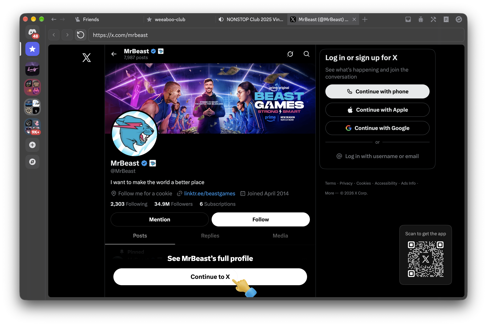

# The Discord Browser
**Your average browser, now lives in your Discord app!**



Very experimental, currently requires the Discord experiment `2026-07-desktop-channel-tabs` and Discord Canary client to function properly. Might break at any moment.

## Installation
As stated above, this only works with Discord Canary desktop client. Usage on any other client is broken.

- Build [Vencord](https://docs.vencord.dev/installing/custom-plugins/) (or [Equicord](https://docs.equicord.org/plugins)) from source and install into your Discord Canary client - follow their instructions on how to install the client mod
- Make the userplugins folder, then clone this repo into the folder (make sure you're in the Equicord/Vencord folder for these commands):
```
mkdir src/userplugins && cd src/userplugins
git clone https://github.com/bloomifycafe/the-discord-browser
```
- Rebuild Equicord/Vencord, relaunch Discord Canary and enable the plugin
- If this is your first time using the plugin: create a Discord tab first (for the + button to appear) and reload the client

## Why?
I have no idea.